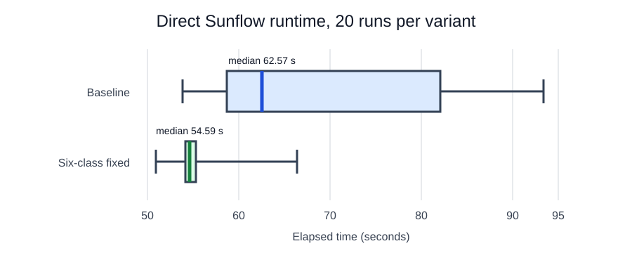

## Run paired measurements

Additional address joins identified four more classes on hot shared boundaries: `InstantGI$PointLight`, `Color`, `Instance`, and `BoundingIntervalHierarchy`. The fixed jar contains all six evidence-derived annotations.

Download [run-sunflow-pairs.sh](run-sunflow-pairs.sh) and [AnalyzeSunflowRuns.java](AnalyzeSunflowRuns.java), then run 20 alternating pairs:

```bash
jdk_home="$(java -XshowSettings:properties -version 2>&1 | \
  awk -F' = ' '/^[[:space:]]*java.home = / { print $2; exit }')"
test -x "${jdk_home}/bin/java"
chmod +x run-sunflow-pairs.sh
./run-sunflow-pairs.sh \
  --java-home "${jdk_home}" \
  --baseline-jar sunflow-build/jars/sunflow-baseline.jar \
  --fixed-jar sunflow-build/jars/sunflow-six-class-contended.jar \
  --janino-jar sunflow-build/janino.jar \
  --output timings \
  --pairs 20 \
  --cpus 0-7 \
  --numa-node 0
```

The script alternates which variant runs first in each pair, pins both variants identically, records stdout, stderr, exit status, elapsed time, and validation text, and writes `timings/runs.csv`. Stop if thermal state, frequency policy, background load, or image validation differs materially between variants.

Summarize the accepted runs:

```bash
java AnalyzeSunflowRuns.java --input timings/runs.csv
```

The analyzer reports median rather than mean as the main runtime statistic, population standard deviation, coefficient of variation (CV), interquartile range (IQR), and paired wins. Keep the raw rows so another reader can audit exclusions.

## Compare the reference result

The reference system completed 20 accepted runs of each variant:

| Statistic | Baseline | Six-class fixed | Change |
| --- | ---: | ---: | ---: |
| Median | 62.573799 s | 54.592332 s | -12.755% |
| Population standard deviation | 14.080178 s | 3.310145 s | -76.490% |
| CV | 0.201479 | 0.059801 | -70.319% |
| IQR | 23.373579 s | 1.157873 s | -95.046% |



The lower median indicates a runtime speedup, while the smaller standard deviation, CV, and IQR show lower variability. Treat these as results for this workload, JDK, and machine configuration—not as a universal Sunflow speedup.

## What you've accomplished

You moved from a promising single C2C comparison to a repeated paired experiment and quantified both speed and stability. Next, you will review the complete attribution and validation workflow.
