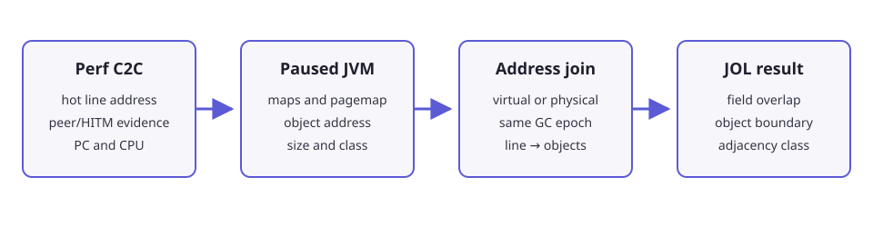

## Combine three evidence domains

Perf C2C can rank hot cache-line addresses, but it does not identify Java
objects. A conventional HPROF file identifies classes and references, but its
object identifiers are not normally live virtual addresses.

An exact runtime attribution combines:



| Evidence | Key information |
| --- | --- |
| `perf c2c report` and `perf script` | Hot line, sharing counts, access PC, CPU, virtual or physical address |
| `/proc/<pid>/maps` and `pagemap` | Virtual memory areas and virtual-page to physical-frame mappings |
| HotSpot Serviceability Agent scan | Object virtual address, size, and class |
| JOL `internals` output | Field offsets within each class layout |

For a physical address, calculate the cache-line base using:

```text
physical_address = pfn * page_size + offset_within_virtual_page
cache_line       = physical_address & ~(cache_line_size - 1)
```

Do not assume that Perf C2C always reports physical addresses. In the Sunflow
Arm SPE capture, the report addresses matched Java heap virtual addresses
directly while pagemap-derived physical addresses occupied a different range.

## Preserve one object-placement epoch

The object map, pagemap snapshot, and samples must describe the same placement
of objects. Reject the join when:

- a moving or compacting GC occurred between sampling and the snapshot;
- the JVM exited before the object scan;
- pagemap PFNs were hidden when a physical join was required;
- the Serviceability Agent used JDK binaries that did not match the target;
- both address domains appear plausible and no independent evidence resolves them.

Use a fixed heap large enough to avoid collection during the hot window and
record GC logs. A workload-controlled latch immediately after the sampled hot
phase is preferable to a timed signal.

{}
A precise-looking join is still invalid when it crosses an object-moving GC.
Do not reuse object addresses between separate JVM runs.
{}
