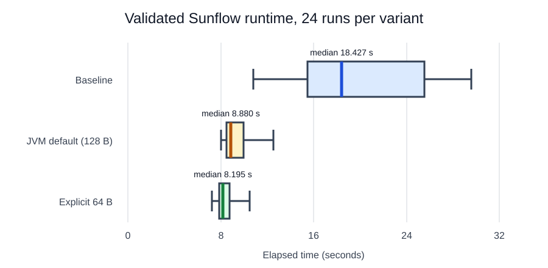

## Run paired measurements

The updated address join identified seven concrete Sunflow classes on hot cache lines: `Matrix4`, `BoundingIntervalHierarchy`, `IntersectionState`, `BucketRenderer$BucketThread`, `KDTree`, `BucketRenderer$ImageSample`, and `Color`. The all-captured-classes fixed jar contains these evidence-derived annotations.

Download [run-sunflow-pairs.sh](run-sunflow-pairs.sh) and [analyze-sunflow-runs.java](analyze-sunflow-runs.java), then run 20 alternating pairs:

```bash
jdk_home="$(java -XshowSettings:properties -version 2>&1 | \
  awk -F' = ' '/^[[:space:]]*java.home = / { print $2; exit }')"
test -x "${jdk_home}/bin/java"
chmod +x run-sunflow-pairs.sh
./run-sunflow-pairs.sh \
  --java-home "${jdk_home}" \
  --baseline-jar sunflow-build/jars/sunflow-baseline.jar \
  --fixed-jar sunflow-build/jars/sunflow-all-captured-classes-contended.jar \
  --janino-jar sunflow-build/janino.jar \
  --output timings \
  --pairs 20 \
  --numa-node 0
```

The script alternates which variant runs first in each pair, allows both variants to use every processor visible to the JVM, records stdout, stderr, exit status, elapsed time, and validation text, and writes `timings/runs.csv`. Stop if processor availability, thermal state, frequency policy, background load, or image validation differs materially between variants.

Summarize the accepted runs:

```bash
java analyze-sunflow-runs.java --input timings/runs.csv
```

The analyzer reports median rather than mean as the main runtime statistic, population standard deviation, coefficient of variation (CV), interquartile range (IQR), and paired wins. Keep the raw rows so another reader can audit exclusions.

## Compare the recorded result

The test system recorded 20 runs of each variant. The descriptive statistics calculated from the elapsed times are:

| Statistic | Baseline | All-captured-classes fixed | Change |
| --- | ---: | ---: | ---: |
| Median | 19 s | 7.1 s | -62% |
| Population standard deviation | 3.5 s | 1.3 s | -62% |
| CV | 0.19 | 0.18 | -7.3% |
| IQR | 3.8 s | 0.19 s | -95% |



The all-captured-classes fixed median is 62% lower, and its population standard deviation, CV, and IQR are also lower. The fixed variant was faster in all 20 paired comparisons.

Every CSV row has process status `0`, accepted value `1`, and validation `image_check_passed`. The comparison therefore passes the benchmark's correctness gate. Treat the improvement as specific to this workload, JDK, processor availability, and machine configuration.

## What you've accomplished

You validated 20 paired runs and measured a lower, more consistent runtime distribution for the all-captured-classes variant. Next, you will review the complete attribution and validation workflow.
